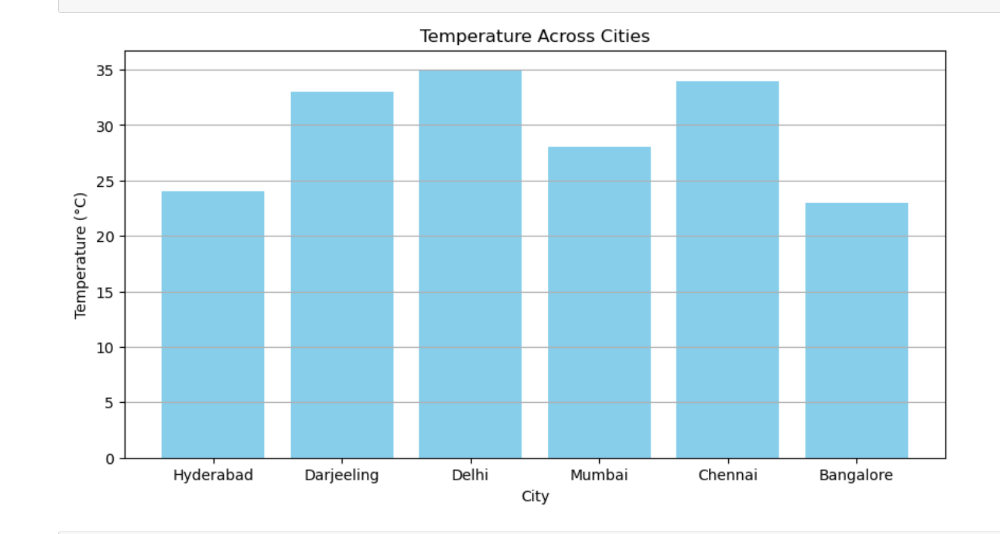
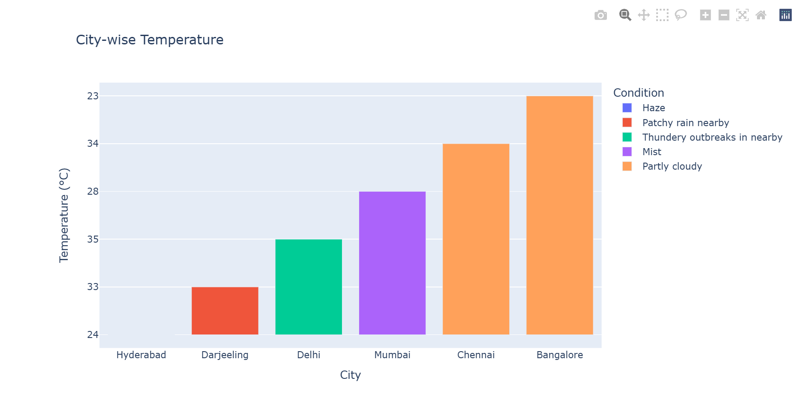
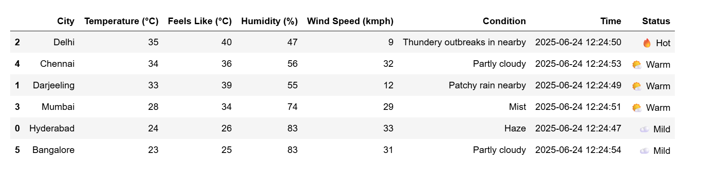

# Live Weather Dashboard using Web Scraping

This project is a live weather dashboard developed using Python and Jupyter Notebook. It scrapes current weather data from a public weather website and presents it visually through plots and tabular summaries. The dashboard enables users to view real-time weather information for selected cities.

## Project Overview

- **Data Source**: Weather information is scraped using `requests` and `BeautifulSoup` from a public website.
- **Visualization**: Created using `matplotlib` and `pandas`.
- **Output**: Plots include temperature comparison, humidity levels, and a clean tabular display of weather conditions.

## Features

- Live web scraping of real-time weather data.
- Dynamic visualizations for key weather metrics.
- Saves data to a CSV file (`weather_data.csv`) for recordkeeping.
- Clean and readable output dashboard in Jupyter Notebook.

## Files Included

- `Live Weather Dashboard using Web Scraping.ipynb`: Main Jupyter Notebook containing the code.
- `weather_data.csv`: Exported dataset in CSV format.
- `weather_plot1.png`: Plot comparing temperature across cities.
- `weather_plot2.png`: Plot showing humidity or wind speed.
- `weather_table.png`: Screenshot of tabular weather summary.
- `requirements.txt`: List of required Python libraries.

## Folder Structure

weather-dashboard/
│
├── Live Weather Dashboard using Web Scraping.ipynb
├── weather_data.csv
├── requirements.txt
├── weather_plot1.png
├── weather_plot2.png
├── weather_table.png
└── README.md

## Visuals

### Temperature Comparison


### Humidity / Wind Speed Chart


### Weather Table Summary

## How to Run

1. Clone this repository or download the files manually.
2. Install the required dependencies:

   ```bash
   pip install -r requirements.txt


